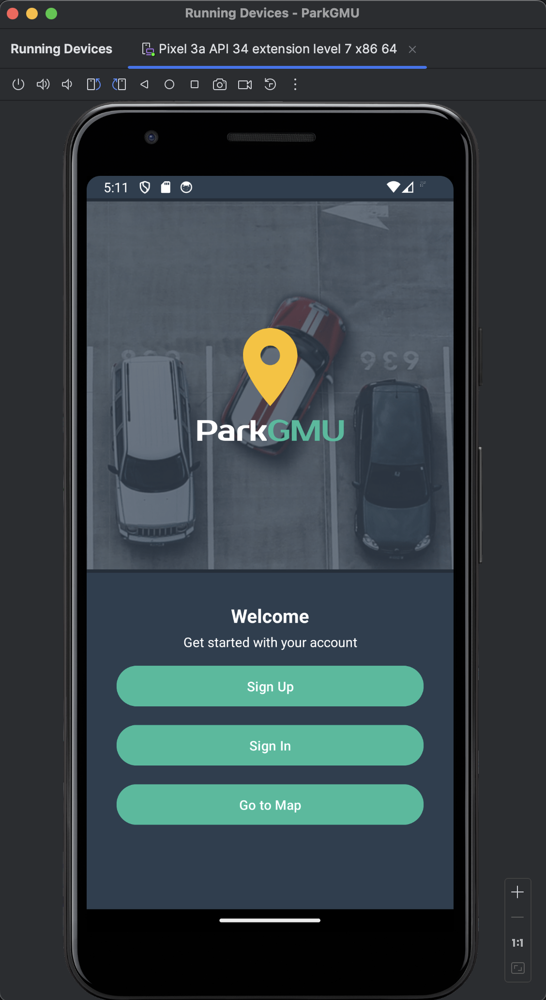
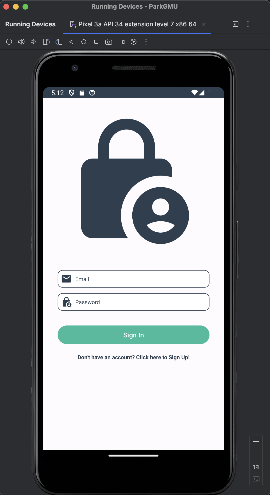
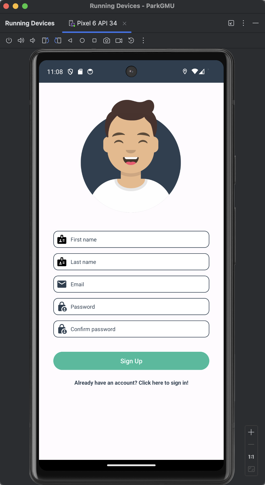
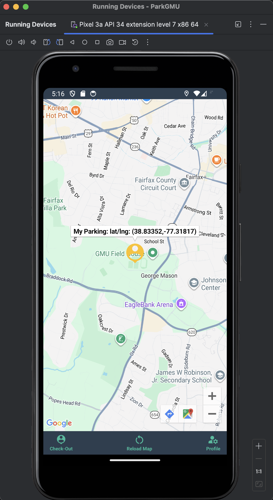

# ParkGMU — Smart Campus Parking App

## 📌 Overview
ParkGMU is a real-time Android application that helps students at George Mason University find and share parking availability using Google Maps and Firebase.

The app allows users to discover open parking spots, claim them, and navigate directly to their parked vehicle.

---

## 📸 App Screenshots

### 🏠 Welcome Screen

### 🔐 Login Screen

### 📝 Sign Up Screen

### 🗺️ Parking Map (Available Spots)

### 📍 Check-In (Claimed Spot)

### 📍 Current Location

---

## ✨ Features

- Firebase Authentication (Sign Up / Sign In / Email Verification)
- Google Maps integration with real-time parking markers
- Check-In / Check-Out system for parking spots
- Navigation to parked vehicle using Google Maps
- User profile with parking information
- Persistent login session handling

---

## 🏗️ Tech Stack

- Frontend: Android (Java, XML)
- Maps: Google Maps SDK
- Backend: Firebase Firestore
- Authentication: Firebase Authentication
- Location: Android Location Services

---

## ⚙️ Setup Instructions

### 1. Clone the repository

git clone https://github.com/fisehagk/gmu-parking-app.git

### 2. Open in Android Studio

Open the project folder in Android Studio.

### 3. Configure Firebase

- Add your own `google-services.json`
- Enable Authentication (Email/Password)
- Enable Firestore Database

### 4. Add Google Maps API Key

Add this line to your `local.properties` file:

MAPS_API_KEY=your_api_key_here

### 5. Run the application

- Use an emulator or physical device
- Enable location services

---

## 📂 Project Structure

<pre>
ParkGMU/
├── app/
│   ├── src/
│   │   ├── main/
│   │   │   ├── java/com/example/parkgmu/
│   │   │   │   ├── MainActivity.java
│   │   │   │   ├── MapsActivity.java
│   │   │   │   ├── SignInActivity.java
│   │   │   │   ├── SignUpActivity.java
│   │   │   │   ├── UserProfileActivity.java
│   │   │   │   ├── User.java
│   │   │   │   └── MyMarker.java
│   │   │   ├── res/
│   │   │   │   ├── layout/
│   │   │   │   ├── drawable/
│   │   │   │   └── values/
│   │   │   └── AndroidManifest.xml
│   │   └── google-services.json
├── assets/
│   └── images/
├── build.gradle.kts
├── settings.gradle.kts
└── README.md
</pre>

---

## 🚀 Future Improvements

- Real-time updates using Firestore listeners
- Parking expiration timers
- Push notifications
- UI/UX improvements
- ML-based parking prediction

---

## 💡 Highlights

- Real-world problem solving (campus parking)
- Full-stack mobile + cloud integration
- Real-time data synchronization
- Clean modular architecture

---

## 👤 Author

Fiseha K.
